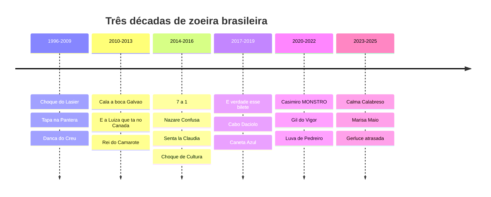

# 🇧🇷 Memeteca Brasileira

> Um acervo da zoeira nacional: **124 memes de origem brasileira**, de 1996 a 2025 — do choque do Lasier ao "morango do ódio".
> Organizado do mais antigo pro mais recente.

`124 memes`  ·  `1996 → 2025`  ·  `6 eras + atemporais`  ·  `100% Markdown`

---

## 📼 Como ler este catálogo

- Vai **do mais velho pro mais novo**, dividido em 6 eras.
- Cada ficha tem: **ano** · **o que é / por que ficou famoso** · **bordão**.
- Meme importado (Skibidi, "six seven", Wandinha…) **não entra na contagem** — fica listado à parte lá no fim.
- Cada era está dentro de um `
` — clica pra abrir.

> [!NOTE]
> Boa parte dos links leva a uma **busca**, não à fonte original. Serve de ponto de partida; confirme antes de dar como certo.

---

## 🗺️ A linha do tempo

| Era | Quando | Qtd | O clima |
| :-- | :----: | :-: | :------ |
| 🦕 A pré-história | até 2009 | 8 | fórum, Orkut, fotolog, vídeo de cassetada |
| 📼 YouTube tupiniquim | 2010–2013 | 19 | primeiros virais de vídeo, TT mundial, funk furando a bolha |
| 📘 Era de ouro do Facebook | 2014–2016 | 26 | Copa, BBB, funk 150 bpm, página de humor |
| 📱 Reels e textão | 2017–2019 | 15 | hit de rua, eleição, "aloca", bilete |
| 🦠 Pandemia e lives | 2020–2022 | 27 | live-show, TikTok, Casimiro, Luva de Pedreiro |
| 🧠 Trend, IA e brainrot | 2023–2025 | 20 | som de TikTok, cadeirada, Marisa Maiô |
| ⭐ Sem época | — | 9 | Nazaré, Mussum, Faustão, grupo da família |

---

## 🔥 Se você só olhar 12

Os que qualquer brasileiro reconhece na hora:

| Meme | Ano | Bordão |
| :-- | :-: | :-- |
| Nazaré Confusa | 2016 | virou padrão mundial ("Math Lady") |
| 7 a 1 | 2014 | *"estava escrito"* |
| É Verdade Esse Bilete | 2018 | *"é verdade esse bilete"* |
| Cala a Boca Galvão | 2010 | *"Cala a boca, Galvão!"* |
| Caneta Azul | 2019 | *"caneta azul, azul caneta"* |
| Nazaré Tedesco | 2004+ | *"lixo, verme, escória!"* |
| Tá Tranquilo, Tá Favorável | 2015 | *"tá tranquilo, tá favorável"* |
| Luva de Pedreiro | 2022 | *"Receba!"* |
| Senta Lá, Cláudia | ~2015 | *"aham, Cláudia. Senta lá."* |
| Mimimi | 2016 | *"mimimi"* |
| Gil do Vigor | 2021 | *"vigor!"* |
| É um Jogo, Cézar! | 2015 | *"é um jogo, Cézar!"* |

---

## 📚 O acervo

### 🦕 A pré-história · até 2009

*Era o tempo do vídeo que rodava por e-mail e do meme que era só uma foto com Impact escrito por cima.*

<b>abrir — 8 memes</b>

 

| Ano | Meme | O que é | Bordão |
| :--: | :-- | :-- | :-- |
| 1996 | [Choque na Festa da Uva](https://www.youtube.com/results?search_query=lasier+martins+choque+festa+da+uva) | o repórter Lasier Martins toma um choque ao vivo num cacho de uvas decorativo em Caxias do Sul | *"Aaai! Aaai!"* |
| 2005 | [Sanduíche-iche](https://www.youtube.com/results?search_query=ruth+lemos+sanduiche+iche) | nutricionista trava numa entrevista ao vivo por atraso do ponto e passa a repetir sílabas | *"sanduíche-iche-iche"* |
| 2005 | [Taca-le Pau Nesse Carro](https://www.youtube.com/results?search_query=taca+le+pau+nesse+carro) | menino filma o primo descendo a "ladeira da Vó Salvelina" de carrinho de rolimã | *"taca-le pau nesse carro!"* |
| 2006 | [Tapa na Pantera](https://museudememes.com.br/colecoes/tapa-na-pantera/) | curta com a atriz Maria Alice Vergueiro num depoimento cômico sobre maconha; um dos primeiros virais do país | *"dar um tapa na pantera"* |
| 2006 | [Jeremias Muito Louco](https://www.youtube.com/results?search_query=jeremias+muito+louco) | motoqueiro embriagado dá entrevista à polícia com frases absurdas e calma total | *"se eu pudesse, eu matava mil"* |
| 2008 | [Dança do Créu](https://www.youtube.com/results?search_query=mc+creu+danca+do+creu) | o funk e a coreografia rebolativa furam a bolha via Pânico e Domingão; "créu" vira verbo | *"vai, créu!"* |
| ~2000s | [As árvores somos nozes](https://www.google.com/search?q=as+árvores+somos+nozes+meme) | foto de cartaz escolar com erro clássico de português; ícone do humor da era Orkut | *"as árvores somos nozes"* |
| ~2000s | [Show do Milhão / "50 mil pra quem calar a boca"](https://www.youtube.com/results?search_query=show+do+milhao+50+mil+pra+quem+calar+a+boca) | paródia de Silvio Santos oferecendo grana pra alguém calar a boca | *"50 mil reais pra quem calar a boca…"* |

### 📼 YouTube tupiniquim · 2010–2013

*A internet BR aprende a viralizar vídeo — e descobre que dá pra sequestrar o Twitter do mundo inteiro.*

<b>abrir — 19 memes</b>

 

| Ano | Meme | O que é | Bordão |
| :--: | :-- | :-- | :-- |
| 2010 | [Cala a Boca Galvão](https://pt.wikipedia.org/wiki/Cala_a_Boca_Galv%C3%A3o) | na Copa, BR faz TT mundial e inventa a "campanha pra salvar a ave Galvão" pra enganar gringo | *"Cala a boca, Galvão!"* |
| 2010 | [Tiririca](https://www.youtube.com/results?search_query=tiririca+pior+que+ta+nao+fica) | o palhaço faz campanha absurda e é eleito o deputado federal mais votado do país | *"pior que tá não fica"* |
| 2010 | [Restart / "happy rock"](https://pt.wikipedia.org/wiki/Restart_(banda)) | a banda de roupa colorida vira alvo das tribos e piada nacional | *"Restart não, por favor"* |
| 2011 | [Rebolation](https://www.youtube.com/results?search_query=rebolation+2011) | o hit e a coreografia de rebolado dominam as festas; "rebolation" = dancinha genérica | *"vai, rebolation!"* |
| 2011 | [Ai Se Eu Te Pego](https://pt.wikipedia.org/wiki/Ai_Se_Eu_Te_Pego) | sertanejo viraliza no mundo todo; jogador comemora gol com a coreografia | *"nossa, nossa, assim você me mata"* |
| 2012 | [Nissim Ourfali](https://www.youtube.com/results?search_query=nissim+ourfali+bar+mitzvah) | bar mitzvah caríssimo com paródia musical; a família tenta censurar e piora tudo | *"Nissim, o filho, o irmão, o amigo"* |
| 2012 | [E a Luiza, que tá no Canadá](https://www.youtube.com/results?search_query=e+a+luiza+que+ta+no+canada) | legenda de foto de família no Faustão vira desculpa universal pra ausência | *"e a Luiza, que tá no Canadá"* |
| 2012 | [Serjão Berranteiro](https://www.youtube.com/results?search_query=serjão+berranteiro) | o "caçador de onças" imita o berro do bicho em entrevista | o berro da onça |
| 2012 | [Que Isso, Companheiro](https://www.google.com/search?q=que+isso+companheiro+meme) | frase do caso Carlinhos Cachoeira vira reação de falsa indignação | *"que isso, companheiro!"* |
| 2012 | [Val Marchiori — "você é ridícula"](https://www.youtube.com/results?search_query=val+marchiori+voce+e+ridicula) | briga no reality "Mulheres Ricas" (Band) vira áudio | *"você é ridícula, ridícula!"* |
| ~2012 | [Narcisa — "muito feliz, gente"](https://www.youtube.com/results?search_query=narcisa+muito+feliz+gente) | a socialite em euforia constante, falando alto e acelerado | *"eu tô muito feliz, muito feliz, gente!"* |
| 2013 | [Show das Poderosas](https://pt.wikipedia.org/wiki/Show_das_Poderosas) | a estreia de Anitta no mainstream; coreografia copiada em todo canto | *"abre a porteira que lá vou eu"* |
| ~2010 | [Chico Sério / Chico Feliz](https://www.google.com/search?q=chico+serio+chico+feliz+meme) | capa de disco vira montagem de "expectativa vs. realidade" | montagem antes/depois |
| 2013 | [Rei do Camarote](https://www.youtube.com/results?search_query=rei+do+camarote+entrevista) | empresário ensina "regras" de camarote de balada; o esnobismo vira piada instantânea | *"agregar valor"* / *"champagne é status"* |
| 2013 | [Quero Café!](https://www.youtube.com/results?search_query=quero+cafe+meme+reportagem) | senhor idoso invade reportagem num hospital gritando por café | *"QUERO CAFÉÉÉ!"* |
| 2013 | [Luiz Antônio — o menino do polvo](https://www.youtube.com/results?search_query=luiz+antonio+menino+polvo) | criança chora ao entender que o polvo do prato é um animal morto; viralizou no exterior | *"eu gosto que eles fiquem em pé"* |
| 2013 | [Imagina na Copa](https://www.google.com/search?q=imagina+na+copa+meme+2013) | bordão das manifestações de junho pra ironizar serviço público ruim | *"imagina na Copa"* |
| 2013 | [Passinho do Volante](https://www.youtube.com/results?search_query=passinho+do+volante+mc+federado) | funk e o passo de "girar o volante" viram trend nacional de dança | *"não para, não para, não"* |
| ~2013 | [Chocante / clickbait](https://www.google.com/search?q=sites+chocante+voce+nao+vai+acreditar+meme) | enxurrada de sites sensacionalistas no Facebook; "chocante" vira ironia | *"o número 7 vai te surpreender"* |

### 📘 Era de ouro do Facebook · 2014–2016

*Página de humor, funk 150 bpm, o 7 a 1 e o BBB fabricando bordão toda semana. Talvez o auge da produção de meme no Brasil.*

<b>abrir — 26 memes</b>

 

| Ano | Meme | O que é | Bordão |
| :--: | :-- | :-- | :-- |
| 2014 | [Pelézinho](https://www.youtube.com/results?search_query=pelezinho+acerto+mizeravi) | menino erra quase todas as continhas e o adulto comemora como acerto; o "gênio da matemática" | *"acertô, mizeravi!"* |
| 2014 | [Inês Brasil](https://pt.wikipedia.org/wiki/In%C3%AAs_Brasil) | vídeo de inscrição pro BBB dançando, se jogando no chão e apelando pra Deus | *"help me God (…) little children of Jesus"* |
| 2014 | [7 a 1](https://pt.wikipedia.org/wiki/Jogo_entre_Brasil_e_Alemanha_na_Copa_do_Mundo_FIFA_de_2014) | o Brasil leva 7 a 1 da Alemanha em casa; vira unidade de medida nacional de vexame | *"estava escrito"* / *"7x1"* |
| 2014 | [Sofrência](https://pt.wikipedia.org/wiki/Sofr%C3%AAncia) | o termo (Cristiano Araújo) pra música de dor de cotovelo entra pro vocabulário | *"tô na sofrência"* |
| 2014 | [Lepo Lepo](https://www.youtube.com/results?search_query=psirico+lepo+lepo) | hit de Carnaval de Salvador, música mais tocada do país | *"sem dinheiro eu não fico com você"* |
| 2015 | [É um Jogo, Cézar!](https://www.youtube.com/results?search_query=e+um+jogo+cezar+bbb15) | a sister Amanda grita com o brother Cézar no BBB 15; vira áudio de treta de reality | *"é um jogo, Cézar!"* |
| 2015 | [Sarrada no Ar](https://www.youtube.com/results?search_query=sarrada+no+ar+meme) | a "estocada no ar" vira trend e até comemoração de gol na Copa | a estocada no ar |
| 2015 | [Baile de Favela](https://www.youtube.com/results?search_query=mc+joao+baile+de+favela) | um dos funks que botam o "150 bpm" paulista no mainstream | *"baile de favela"* |
| 2015 | [Tá Tranquilo, Tá Favorável](https://www.youtube.com/results?search_query=mc+bin+laden+ta+tranquilo+ta+favoravel) | refrão de MC Bin Laden vira bordão nacional de "tá tudo sob controle" | *"tá tranquilo, tá favorável"* |
| ~2015 | [Hoje eu tô Loki](https://www.google.com/search?q=hoje+eu+to+loki+meme) | expressão de funk vira legenda padrão de story de balada | *"hoje eu tô loki"* |
| 2015 | [Chapolin Sincero](https://www.google.com/search?q=chapolin+sincero+meme) | prints do Chapolin com legendas pessimistas sobre a vida adulta; formato mais copiado do Face | *"não contavam com a minha sinceridade"* |
| ~2015 | [Nunca Nem Vi](https://www.google.com/search?q=nunca+nem+vi+meme+origem) | bordão pra negar qualquer vínculo com uma pessoa ou treta | *"nunca nem vi"* |
| 2015–16 | [Dilma — "estocar vento"](https://www.google.com/search?q=dilma+frases+meme+estocar+vento) | frases confusas + o contexto do impeachment viram um baú de memes | *"não vai ter golpe"* / *"estocar vento"* |
| 2016 | [Mimimi](https://www.youtube.com/results?search_query=ana+paula+renault+mimimi+bbb16) | Ana Paula Renault (BBB 16) populariza "mimimi" pra debochar de reclamação alheia | *"mimimi"* |
| ~2015 | [Senta Lá, Cláudia](https://museudememes.com.br/colecoes/senta-la-claudia/) | fala antiga do Xou da Xuxa vira resposta debochada pra quem fala besteira | *"aham, Cláudia. Senta lá."* |
| 2016 | [Nazaré Confusa](https://pt.wikipedia.org/wiki/Nazar%C3%A9_Confusa) | a vilã com cara de confusão e fórmulas sobrepostas; vira padrão global ("Math Lady") | cara de confusão + contas |
| 2016 | [Ata da Mônica](https://www.google.com/search?q=ata+da+monica+meme) | a Mônica no computador responde um seco "ata" | *"ata"* |
| 2016 | [Bambam / BIRL](https://www.youtube.com/results?search_query=bambam+birl) | ex-BBB fisiculturista grita, rasga a camisa e "explode"; trilha de vídeo de academia | *"é BIRL!"* |
| 2016 | [Aloca](https://www.youtube.com/results?search_query=christian+figueiredo+aloca) | o grito do youtuber Christian Figueiredo pra reagir a fofoca vira interjeição nacional | *"ALOOOCA!"* |
| ~2016 | [Carreta Furacão](https://www.youtube.com/results?search_query=carreta+furacao) | trio elétrico infantil tosco com "Hulk", "Homem-Aranha" e "homem de rosa" | *"é a Carreta Furacão!"* |
| 2016 | [Meme Raiz vs Nutella](https://www.google.com/search?q=meme+raiz+vs+nutella) | formato de comparação "antigo sofrido vs. moderno mimado" aplicado a tudo | *"X raiz / X nutella"* |
| 2016 | [Deu Onda](https://www.youtube.com/results?search_query=mc+g15+deu+onda) | o funk de MC G15 vira trilha de vídeo de tombo e "deu ruim" | *"aí deu onda"* |
| 2016 | [Malandramente](https://www.youtube.com/results?search_query=malandramente+dennis+dj) | hit de Dennis DJ e a coreografia de girar a mão | *"hããã, malandramente"* |
| 2016 | [Paredão Metralhadora](https://www.youtube.com/results?search_query=vingadora+paredao+metralhadora) | hit de Carnaval de MS com a "dança da metralhadora" | *"ai, ai, ai, ai"* + gesto |
| 2016 | [Temer Bruxão](https://www.google.com/search?q=temer+bruxao+vampiro+meme) | montagens de Michel Temer como vampiro/bruxo articulador das sombras | *"o Bruxão"* |
| 2016 | [Choque de Cultura](https://www.youtube.com/results?search_query=choque+de+cultura) | "motoristas de van" criticam filmes de forma tosca e genial; vira culto e depois série | *"vlei"* |

### 📱 Reels e textão · 2017–2019

*O hit de rua vira febre nacional, a eleição de 2018 fabrica meme dos dois lados, e todo mundo escreve "textão".*

<b>abrir — 15 memes</b>

 

| Ano | Meme | O que é | Bordão |
| :--: | :-- | :-- | :-- |
| 2017 | [Olha a Explosão](https://www.youtube.com/results?search_query=mc+kevinho+olha+a+explosao) | o funk de Kevinho e a coreografia dominam festas, comerciais e edições | *"totototo, olha a explosão"* |
| 2017 | [Bum Bum Tam Tam](https://pt.wikipedia.org/wiki/Bum_Bum_Tam_Tam) | funk de MC Fioti que sampleia Bach; um dos vídeos brasileiros mais vistos do YouTube | *"bum bum tam tam"* |
| 2017 | [Que Tiro Foi Esse](https://pt.wikipedia.org/wiki/Que_Tiro_Foi_Esse%3F) | o hit de Jojo Todynho vira bordão pra reagir a acontecimento forte | *"que tiro foi esse?"* |
| 2017 | [Vai, Malandra](https://pt.wikipedia.org/wiki/Vai_Malandra) | clipe de Anitta no Vidigal com biquíni de fita isolante vira evento nacional | *"vai, malandra"* |
| 2017 | [Ó o Gás!](https://www.youtube.com/results?search_query=o+o+gas+carnaval+2017) | refrão de Carnaval vira coreografia via funcionários de distribuidora de gás | *"ó o gás!"* |
| 2018 | [É Verdade Esse Bilete](https://pt.wikipedia.org/wiki/%C3%89_verdade_esse_bilete) | bilhete de um menino de 5 anos tentando faltar aula; formato "mentira + a frase" | *"é verdade esse bilete"* |
| 2018 | [Neymar Rolando](https://www.youtube.com/results?search_query=neymar+challenge+rolando+copa+2018) | Neymar exagera uma queda e rola metros no gramado; o mundo imita (#NeymarChallenge) | *"rolou tipo Neymar"* |
| 2018 | [Cabo Daciolo](https://pt.wikipedia.org/wiki/Cabo_Daciolo) | candidato à presidência com falas messiânicas, "Nova Ordem Mundial" e o plano "Órion" | *"GLÓRIA A DEUS!"* |
| 2018 | [Barbie Fascista](https://www.instagram.com/barbie_fascista/) | perfil com Barbies encenando o estereótipo da direita raivosa de classe média | *"O PT acabou com a minha vida!"* |
| 2018 | [Não Seja Mané](https://www.youtube.com/results?search_query=lula+nao+seja+mane) | Lula fala isso antes de ser preso; "mané" vira bordão político dos dois lados | *"não seja mané"* |
| 2018 | [Jenifer](https://pt.wikipedia.org/wiki/Jenifer_(can%C3%A7%C3%A3o)) | o hit de Gabriel Diniz; todo mundo com uma amiga Jenifer postou o vídeo | *"sem parar de pensar em Jenifer"* |
| 2018 | [Envolvimento](https://www.youtube.com/results?search_query=mc+loma+envolvimento) | 3 adolescentes de Recife (MC Loma e as Gêmeas) viralizam com música e dança | *"tá com envolvimento"* |
| 2019 | [Caneta Azul](https://pt.wikipedia.org/wiki/Caneta_Azul) | o vigilante Manoel Gomes canta a cappella sobre perder a caneta; vira fenômeno nacional | *"caneta azul, azul caneta"* |
| 2019 | [Surtada](https://www.youtube.com/results?search_query=surtada+remix+mc+nem) | o funk (MC Nem / Dadá Boladão) vira uma das trends de dança mais feitas do ano | *"ela é surtada"* |
| 2019 | [Bolsonaro — "01, 02, 03"](https://www.google.com/search?q=zero+um+bolsonaro+meme+rachadinha) | a numeração dos filhos e o termo "rachadinha" viram bordão de zoeira política | *"o zero-quatro"* / *"rachadinha"* |

### 🦠 Pandemia e lives · 2020–2022

*Todo mundo em casa, sertanejo fazendo live de 6 horas, o streamer virando popstar e o Luva de Pedreiro saindo do quintal pra propaganda global.*

<b>abrir — 27 memes</b>

 

| Ano | Meme | O que é | Bordão |
| :--: | :-- | :-- | :-- |
| 2020 | [Buteco em Casa / lives](https://www.youtube.com/results?search_query=gusttavo+lima+buteco+em+casa+live+2020) | sertanejo faz live-show maratonada na pandemia; "bebeu demais na live" vira piada | *"toma uma!"* |
| 2020 | [Um Pouco Mais](https://www.youtube.com/results?search_query=thiago+ventura+um+pouco+mais+300) | stand-up de Thiago Ventura parodiando "300" com a "estratégia" de só andar mais | *"um pouco mais"* |
| 2020 | [Vira-Lata Caramelo](https://www.google.com/search?q=vira-lata+caramelo+meme) | o cachorro caramelo (SRD) vira símbolo nacional afetivo e meme | *"caramelo é raça, sim"* |
| 2020 | [Vai Pra Onde? (Pocoyo)](https://www.google.com/search?q=pocoyo+vai+pra+onde+meme) | reaction pra decisão sem sentido (o Brasil "se metendo" no conflito EUA–Irã) | *"vai pra onde?"* |
| ~2020 | [PQP, a Xiaomi Caiu](https://www.youtube.com/results?search_query=pqp+a+xiaomi+caiu) | o celular cai da bancada na live e o streamer surta; áudio pra tudo que "cai" | *"PQP, a Xiaomi caiu!"* |
| 2020+ | [Casimiro / "MONSTRO!"](https://www.youtube.com/results?search_query=casimiro+cortes+monstro) | o streamer com reações exageradas consolida o formato "react" no Brasil | *"MONSTRO!"* |
| 2021 | [Karol Conká](https://pt.wikipedia.org/wiki/Karol_Conk%C3%A1) | sai do BBB 21 com 99,17% dos votos — a maior rejeição da história de um reality | *"saiu com 99%"* |
| 2021 | [Gil do Vigor](https://pt.wikipedia.org/wiki/Gil_do_Vigor) | o economista do BBB com "vigor" como filosofia; vira celebridade e vai pro doutorado nos EUA | *"vigor!"* / *"brilha pra mim"* |
| 2021 | [Coé, Rodolfo](https://www.youtube.com/results?search_query=coe+rodolfo+bbb21) | áudio de Gilberto chamando o brother repetidamente vira trend de dança | *"coé, Rodolfo"* |
| 2021 | [Juliette](https://pt.wikipedia.org/wiki/Juliette_Freire) | de quase-anônima a maior campeã de audiência do BBB, com um exército de fãs | *"não seco a lágrima, sou maquiadora"* |
| 2021 | [Mó Paz (MC Poze)](https://www.youtube.com/results?search_query=mc+poze+mo+paz) | o rapper fala "em paz" submerso na piscina; usado ironicamente quando a paz vai acabar | *"ah, mó paz"* |
| 2021 | [Pfizer (Esse Menino)](https://www.youtube.com/results?search_query=esse+menino+pfizer+ta+passada) | esquete sobre a demora do governo em responder às ofertas de vacina | *"Pfaaaizer"* / *"tá passada?"* |
| 2021 | [João Gomes — "eu tô sofrendo, ó"](https://www.youtube.com/results?search_query=joao+gomes+meu+pedaco+de+pecado) | o cantor viraliza com piseiro e cara de sofrimento; bota o gênero no mainstream | *"eu tô sofrendo, ó"* |
| 2021 | [Bem-te-vi](https://www.google.com/search?q=meme+bem-te-vi+twitter+2021) | o Twitter troca áudios famosos pelo canto do pássaro | *"o bem-te-vi é o gemidão do bem"* |
| 2021 | [Capitão, Ainda é Quarta-Feira](https://www.google.com/search?q=capit%C3%A3o+ainda+%C3%A9+quarta-feira+meme) | tirinha do Tintin relegendada por BR sobre a semana não acabar nunca | *"capitão, ainda é quarta-feira"* |
| 2021 | [Reage, Bota um Cropped](https://www.google.com/search?q=reage+bota+um+cropped+meme) | o conselho da irmã pra superar um término virou universal | *"reage, bota um cropped"* |
| 2021 | [Cringe](https://www.google.com/search?q=millennial+cringe+meme+2021) | a Gen Z decreta hábitos millennial como vergonhosos; guerra de timeline | *"isso é muito cringe"* |
| 2021 | [Meme do Ônibus](https://knowyourmeme.com/memes/bus-window-cartoon) | charge do catarinense Genildo Ronchi (triste/feliz) vira template mundial de "perspectiva" | template de ponto de vista |
| 2021 | [Girl from Rio (Anitta)](https://www.google.com/search?q=girl+from+rio+meme+anitta) | a capa no ponto de ônibus vira template de photoshop — cada um coloca sua cidade | *"girl from [sua cidade]"* |
| 2021 | [Undererê (Inês Brasil)](https://www.youtube.com/results?search_query=ines+brasil+undererê) | a música de 2016 ressurge no TikTok e volta ao topo do Spotify | *"undererê"* |
| 2022 | [Luva de Pedreiro](https://pt.wikipedia.org/wiki/Luva_de_Pedreiro) | Iran Ferreira grava jogadas no interior da Bahia com energia contagiante; maior fenômeno do futebol nas redes | *"Receba!"* / *"graças a Deus, pai!"* |
| 2022 | [Acorda, Pedrinho](https://www.youtube.com/results?search_query=acorda+pedrinho+forro+no+cariri) | o áudio "hoje tem forró no Cariri" vira trend de dança no TikTok | *"acorda, Pedrinho"* |
| 2022 | [Faz o L](https://www.google.com/search?q=faz+o+l+meme+2022) | o gesto da campanha de Lula vira marca e bordão dos dois lados | *"faz o L"* |
| 2022 | [Lá Ele](https://www.google.com/search?q=la+ele+meme+laeeb) | expressão baiana pra "devolver" um duplo sentido; ganha o país na Copa pelo mascote La'eeb | *"lá ele"* |
| 2022 | [Complexo de Vira-Lata](https://pt.wikipedia.org/wiki/Complexo_de_vira-lata) | volta a discussão da autoestima nacional (Nelson Rodrigues) após a eliminação na Copa | *"complexo de vira-lata"* |
| 2022 | [Deixa Baixo](https://www.google.com/search?q=deixa+baixo+meme+vanessa+panisset) | música da Vanessa Panisset vira pedido de "não comenta esse assunto" | *"deixa baixo"* |
| 2021 | [Datena — "isso é um absurdo" + a cadeira](https://www.youtube.com/results?search_query=datena+isso+e+um+absurdo) | bordões inflamados e o histórico de quase-brigas ao vivo; base de áudios de indignação | *"isso é um absurdo!"* |

### 🧠 Trend, IA e brainrot · 2023–2025

*O TikTok manda no ritmo, a política vira UFC ao vivo, e "brainrot" entra pro dicionário.*

<b>abrir — 20 memes</b>

 

| Ano | Meme | O que é | Bordão |
| :--: | :-- | :-- | :-- |
| 2023 | [Xurrasco / dança do carrossel](https://www.youtube.com/results?search_query=xurrasco+danca+do+carrossel+lovezinho) | o influencer carioca populariza a dança do giro ao som de "Lovezinho"; o visual dele vira estética | a coreografia do giro |
| 2023 | [Fake Natty](https://www.youtube.com/results?search_query=fake+natty+rodrigo+goes) | o influencer fitness Rodrigo Goes "julga" se o corpo de famosos é natural, com "martelinho" | *"meu veredito é: Fake Natty!"* |
| 2023 | [Gente, Vamos Almoçar? (Eleni)](https://www.youtube.com/results?search_query=eleni+gente+vamos+almo%C3%A7ar) | a tiktoker fecha os vídeos de receita com o convite carismático | *"gente, vamos almoçar?"* |
| 2023 | [Sangue de Maria Bonita](https://www.youtube.com/results?search_query=fred+nicacio+sangue+de+maria+bonita) | Fred Nicácio (BBB 23) consola participantes com a frase motivacional | *"você tem sangue de Maria Bonita"* |
| 2023 | [Segovinha](https://www.youtube.com/results?search_query=segovinha+an+an+an) | a torcida do Botafogo musica o nome do meia paraguaio (paródia de "Vai Novinha") | *"Segovinha, an an an"* |
| 2023 | [Eu Vou Tomar um Tacacá](https://www.youtube.com/results?search_query=eu+vou+tomar+um+tacaca+joelma) | a música da Joelma de 2016 viraliza 7 anos depois e leva o tacacá ao debate nacional | *"dançar, curtir e ficar de boa"* |
| 2023–24 | [Meme da Guiana](https://en.wikipedia.org/wiki/Guiana_Brasileira_(meme)) | brasileiros "anexam" a Guiana nas redes com um bordão musicado; rende resposta dos guianenses | *"Guiana Brasileira"* |
| 2023 | [Errejota / "R7"](https://www.google.com/search?q=errejota+meme) | piada com o jeito carioca de falar "Rio de Janeiro" e siglas | *"eu sou do Errejota"* |
| 2024 | [Calma, Calabreso](https://www.youtube.com/results?search_query=calma+calabreso+bbb+24) | Toninho Tornado (BBB 24) chama o oponente de "Calabreso"; vira música e fantasia de Carnaval | *"calma, Calabreso"* |
| 2024 | [Casca de Bala](https://www.youtube.com/results?search_query=casca+de+bala+thullio+milionario) | a música (Thullio Milionário) mais usada por brasileiros no TikTok em 2024 | *"casca de bala"* |
| 2024 | [Criança Chorando nas Paquitas](https://www.youtube.com/results?search_query=crian%C3%A7a+chorando+paquitas+documentario) | cena do documentário "Pra Sempre Paquitas" vira reaction de decepção coletiva | o choro |
| 2024 | [Ana Sátila no Caiaque](https://www.google.com/search?q=ana+satila+caiaque+meme+olimpiadas) | a canoísta vira meme nas Olimpíadas de Paris; "todo mundo virou especialista em canoagem" | *"bateu na boia"* |
| 2024 | [Datena x Marçal / cadeirada](https://www.google.com/search?q=datena+cadeirada+mar%C3%A7al+debate) | Datena acerta uma cadeira em Pablo Marçal no debate da Band pra prefeitura de SP | *"a cadeirada"* |
| 2024 | [Aí Você Quebra o Pace](https://www.google.com/search?q=ai+voce+quebra+o+pace+meme) | áudio sobre algo que quebra o ritmo/fluxo de qualquer coisa | *"aí você quebra o pace"* |
| 2025 | [Morango do Amor](https://www.google.com/search?q=morango+do+amor+morango+do+odio+meme) | o doce vira febre nas festas juninas e piada com receitas dando errado | *"morango do ódio"* |
| 2025 | [Marisa Maiô](https://www.youtube.com/results?search_query=marisa+mai%C3%B4) | "programa de auditório" fictício e surreal (criado por Rao); reencenado na vida real e na TV | o tom de auditório |
| 2025 | [Garçom, Tem Pitú?](https://www.youtube.com/results?search_query=gar%C3%A7om+tem+pitu+laercia+dantas) | Laércia Dantas canta forró de teclado; o pedido vira áudio de trend em novembro | *"garçom, tem Pitú?"* |
| 2025 | [Cheguei, Brasil](https://www.google.com/search?q=cheguei+brasil+pedro+alvares+meme) | "Pedro Álvares Brasil" gritou ao "descobrir" o país; irrita influenciadores portugueses | *"cheguei, Brasil!"* |
| 2025 | [Gerluce Atrasada](https://www.google.com/search?q=gerluce+atrasada+meme) | cena do remake de "Vale Tudo" ilustra qualquer atraso; um dos memes mais usados do ano | *"eu chegando igual a Gerluce"* |
| 2025 | [Vale Tudo — "Quem Matou Odete Roitman?"](https://www.google.com/search?q=quem+matou+odete+roitman+2025+meme) | o remake reacende o mistério clássico da novela brasileira; o país inteiro palpita | *"quem matou Odete Roitman?"* |

### ⭐ Sem época · personagens que viraram idioma

*Não são "um vídeo". São falas e caras que o brasileiro usa no dia a dia sem nem pensar que é meme.*

<b>abrir — 9</b>

 

| Meme | O que é | Bordão |
| :-- | :-- | :-- |
| [Nazaré Tedesco](https://www.google.com/search?q=nazare+tedesco+memes) | a vilã de "Senhora do Destino" (Renata Sorrah): a maior fábrica de reaction da TV BR — o "olhar 43", "sinta o drama" | *"lixo, verme, escória!"* |
| [Gretchen](https://pt.wikipedia.org/wiki/Gretchen_(cantora)) | a cantora vira musa de GIF e reaction pelas expressões nos clipes; "meme queen" pelo NYT | as caras e bocas |
| [Mussum — "cacildis"](https://www.google.com/search?q=mussum+cacildis+meme) | o Trapalhão e o jeito de falar com "-is" no fim das palavras | *"cacildis"* / *"mé"* |
| [Bordões do Faustão](https://www.youtube.com/results?search_query=faustão+bordões) | "errou!", "olha o gás", "ó o auê" — resposta automática pra vacilo online | *"errou!"* |
| [Bordões do Chaves](https://www.google.com/search?q=chaves+bord%C3%B5es+meme) | a dublagem BR é fonte inesgotável de áudio | *"foi sem querer querendo"* |
| [Louro José / "bença"](https://www.youtube.com/results?search_query=louro+jose+ana+maria+braga+meme) | o papagaio e as gafes da Ana Maria Braga na manhã da Globo | *"bença"* |
| [Ivo Holanda / pegadinhas](https://www.youtube.com/results?search_query=ivo+holanda+pegadinha+silvio+santos) | o "senhor da pegadinha" do SBT | *"me dá 1 real"* |
| [Figurinha de "bom dia" com Minions](https://www.google.com/search?q=bom+dia+minions+figurinha+grupo+da+familia) | a imagem-corrente que tio e tia mandam no grupo da família | *"abençoado dia"* |
| ["Sextou" / "Bora, Brasil"](https://www.google.com/search?q=sextou+meme) | bordões de comemoração coletiva que dominam a timeline em bloco | *"sextou!"* |

---

## 🌍 Não são BR (mas todo mundo aqui usa)

> [!IMPORTANT]
> Fora da contagem — importados. Ficam listados só pra referência.

`Homem-Aranha Apontando` · `Mulher Gritando com Gato` · `Wandinha Dançando` · `Gato de Bota Implorando` · `Attenzione Pickpocket` · `Barbenheimer` · `Skibidi Toilet` · `Italian Brainrot` (Tralalero Tralala, Bombardiro Crocodilo) · `6 7 / "six seven"` · `Labubu` · `Filtro Ghibli / IA`

---

## 📎 De onde veio a informação

- [Museu de Memes — UFF](https://museudememes.com.br/) — maior acervo acadêmico de memes brasileiros (prof. Viktor Chagas)
- [Metrópoles](https://www.metropoles.com/sarah-gomes/os-melhores-memes-da-historia-do-brasil) · [Dicionário Popular](https://www.dicionariopopular.com/melhores-memes-brasileiros/) · [Não Óbvio](https://www.naoobvio.com/index.php/2020/06/10/5-listas-para-relembrar-memes-que-bombaram-no-brasil/)
- TechTudo — [memes de 2021](https://www.techtudo.com.br/listas/2021/12/relembre-os-16-melhores-memes-que-bombaram-na-internet-em-2021.ghtml) · [2022](https://www.techtudo.com.br/listas/2022/12/relembre-11-memes-que-bombaram-nas-redes-sociais-em-2022.ghtml) · [2023](https://www.techtudo.com.br/listas/2023/12/melhores-memes-de-2023-relembre-10-virais-que-marcaram-o-ano-edsoftwares.ghtml)
- CNN Brasil — [retrospectiva 2024](https://www.cnnbrasil.com.br/entretenimento/retrospectiva-relembre-memes-e-virais-mais-bombados-de-2024/) · [top 10 de 2025](https://www.cnnbrasil.com.br/pop/de-meme-da-guiana-a-morango-do-amor-veja-top-10-memes-que-bombaram-em-2025/)
- [Novabrasil — clássicos da zoeira](https://novabrasilfm.com.br/arte-e-cultura/classicos-da-zoeira-lista-de-memes-brasileiros-que-nunca-saem-de-moda)

---

Catálogo feito na marra com Markdown e Git · sinta o drama.
